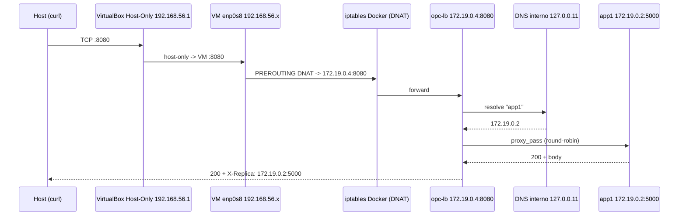

# Redes del despliegue OPC Tickets: IPs, conexiones, DHCP y DNS

> Documento complementario de `infraestructura/README.md`. Explica **todos los
> planos de red** que intervienen en el despliegue, **cómo se asignan las IPs**
> en cada uno (IPAM de Docker vs DHCP de VirtualBox vs estático/loopback), los
> **tipos de conexión**, el **DHCP**, el **DNS** y el **flujo de paquetes** de
> una petición real. No incluye capturas: las evidencias (pantallazos /
> umbrales) las deja el responsable.

---

## 1. Los planos de red involucrados

Este proyecto tiene **tres redes independientes**, y entender las tres es la
clave para leer las IPs en cualquier pantallazo:

| Plano | Red | Quién la crea | Para qué | Tráfico que lleva |
|---|---|---|---|---|
| **A · Red bridge de Docker** | `opc-tickets_default` · `172.19.0.0/16` | Docker Compose | Comunicación **entre contenedores** (lb ↔ app1 ↔ app2) | HTTP interno `:5000`, healthchecks, DNS interno |
| **B · NAT VirtualBox** | `10.0.2.0/24` | VirtualBox | La VM (Debian/Rocky) **sale a Internet**: instalación y `docker pull`/`git clone` | DHCP, DNS saliente, HTTP/HTTPS de salida |
| **C · Host-Only VirtualBox** | `192.168.56.0/24` | VirtualBox (`vboxnet0`) | **Administración** host↔VM: SSH y pruebas del balanceo | SSH `:22`, HTTP `:8080` hacia la VM |

Además hay dos "redes" unipersonales que conviene nombrar:

- **Loopback (`127.0.0.1`)** — dentro de **cada contenedor** (healthchecks) y en
  el host (`localhost`).
- **La red del host real** — donde *Docker Desktop (Windows)* asigna a la VM de
  WSL2/algo su puerto publicado; aquí solo importa que `localhost:8080`
  funcione en el host. Cuando se despliega **en el host Linux** (sin VM), el
  plano B/C desaparecen y solo existen Docker + loopback + la LAN real.

> **Regla de oro:** las IP de las réplicas (`172.19.…`) son **internas de
> Docker** y solo existen *dentro* de la VM/equipo donde corre Compose. Las IP
> `192.168.56.x`/`10.0.2.x` son del **anfitrión VirtualBox**. No se mezclan.

---

## 2. Asignación de direcciones IP, red por red

### 2.1 Red bridge de Docker (`172.19.0.0/16`) — IPAM de Docker

No hay DHCP aquí: Docker usa su **IPAM** (Internet Protocol Address Management)
y asigna IPs **estáticas por contrato** al crear cada contenedor.

- La subred la elige Compose al crear la red la primera vez. En este proyecto
  quedó `172.19.0.0/16` (las `172.16/12` son el bloque privado clásico de
  Docker para bridges).
- Numeración observada:

| Elemento | IP | Rol |
|---|---|---|
| Puerta del bridge | `172.19.0.1` | gateway en el host (veth) |
| `app1` | `172.19.0.2` | 1.ª réplica (1.er contenedor en arrancar) |
| `app2` | `172.19.0.3` | 2.ª réplica |
| `lb` (Nginx) | `172.19.0.4` | balanceador |

  El orden de asignación es **el orden de creación de los contenedores**
  (docker asigna la siguiente dirección libre), no un orden alfabético: si se
  arranca primero `lb`, se llevaría el `.2`.

- **Las IP pueden rotar**: si eliminas y recreas un contenedor, recibe la
  siguiente IP libre (normalmente la misma si nadie la tomó, pero **no está
  garantizado**). Por eso el upstream de Nginx usa los **nombres** `app1`/`app2`
  (DNS de Compose) y nunca IPs.
- Cómo consultarlo:

```bash
docker network inspect opc-tickets_default          # Containers -> IPs
docker inspect -f '{{.Name}} {{range .NetworkSettings.Networks}}{{.IPAddress}}{{end}}' opc-app-1 opc-app-2 opc-lb
```

### 2.2 NAT de VirtualBox (`10.0.2.0/24`) — DHCP de VirtualBox

VirtualBox **embebe un servidor DHCP** para el modo NAT y asigna
automáticamente a la 1.ª NIC de la VM, con estos valores por defecto:

| Elemento | Valor | Nota |
|---|---|---|
| IP de la VM | `10.0.2.15` | asignada por el DHCP de VirtualBox para NAT |
| Gateway / host | `10.0.2.2` | la puerta es la propia máquina anfitrión |
| DNS (forwarder) | `10.0.2.3` | VirtualBox hace de *DNS proxy* hacia los servidores del host |

- El NAT permite **salida** (la VM descarga paquetes, `docker pull`…) pero
  **nadie del exterior puede entablar conexiones** hacia la VM por esta vía.
- Si el instalador de Debian "reniega" de la red, la guía documenta la
  **configuración manual**: `10.0.2.15/24`, gateway `10.0.2.2`, DNS `10.0.2.3`.

### 2.3 Host-Only VirtualBox (`192.168.56.0/24`) — DHCP de VirtualBox

Al crear la red `vboxnet0` con el *Network Manager*, VirtualBox deja:

| Elemento | Valor |
|---|---|
| IP del host (adaptador VirtualBox) | `192.168.56.1/24` |
| Rango DHCP para la VM | `192.168.56.2 – 192.168.56.254` |
| Concesión a la VM | la primera libre (típicamente `192.168.56.2`, pero **no lo des por hecho**) |

- Es una red **aislada de la LAN** real: solo comunican host ↔ VM(s).
- La VM recibe una IP del rango por DHCP. **No es fija por defecto**: si el
  servidor DHCP de VirtualBox conserva la concesión por MAC, suele ser estable
  entre reinicios, pero ante recreaciones de la VM/cambios de NIC puede variar.
  → En cada VM nueva, **verifica la IP real** con `ip -4 addr show` y anótala en
  tu informe (la guía FASE 4/§6 lo pide explícitamente).
- Cómo comprobar concesiones: `VBoxManage list dhcpservers` (el "servidor" del
  Host-Only) o en la VM `ip -4 addr show`.

### 2.4 Resumen de direcciones (tabla de referencia)

| ¿Quién? | Red | Dirección | Fuente de asignación |
|---|---|---|---|
| host ↔ VM (SSH) | Host-Only | `192.168.56.1` / `192.168.56.x` | VirtualBox (host) / DHCP (VM) |
| VM → Internet | NAT | `10.0.2.15` / gw `10.0.2.2` / DNS `10.0.2.3` | DHCP de VirtualBox (NAT) |
| `opc-lb` | Docker | `172.19.0.4` (`:8080` publicado en `0.0.0.0`) | IPAM Docker |
| `opc-app-1` | Docker | `172.19.0.2:5000` | IPAM Docker |
| `opc-app-2` | Docker | `172.19.0.3:5000` | IPAM Docker |
| DNS interno | Docker | `127.0.0.11` (embebido en el bridge) | Docker |
| loopback (healthchecks) | contenedor/host | `127.0.0.1` | — |

---

## 3. Tipos de conexión / modos de red

### 3.1 En VirtualBox

| Modo | Sentido | ¿Entradas desde fuera? | Uso aquí |
|---|---|---|---|
| **NAT** | VM → Internet | No | instalación del SO, `docker pull`, `git clone` |
| **Host-Only** | host ↔ VM | Solo desde el host | SSH + pruebas HTTP del balanceo |
| Bridged (no usado) | VM en la LAN real | Sí (si el FW lo permite) | **descartado** a propósito: expondría la VM a la LAN sin necesidad |
| Internal (no usado) | solo entre VMs | No | innecesario con una sola VM |

**Por qué NAT + Host-Only y no Bridged:** con NAT la VM navega; con Host-Only la
administras y pruebas el balanceo **sin exponer la VM a la red de la oficina**.
Si usaras Bridged, `8080` (y cualquier otro servicio) podría verse desde la LAN.

### 3.2 En Docker

| Modo | Qué es | Uso aquí |
|---|---|---|
| **bridge** (por defecto de Compose) | red privada virtual entre contenedores + DNAT opcional | el proyecto: red `opc-tickets_default` |
| bridge por defecto `bridge` | red por defecto de Engine, sin DNS por servicio | **no usado** |
| `host` | el contenedor comparte la pila del host (sin aislamiento de red) | **no usado** |
| `none` | sin red | **no usado** |
| macvlan/ipvlan | IPs de la LAN real por MAC | **no usado** |

- **`ports` vs `expose`:** `ports: "8080:8080"` solo en `lb` = publicación +
  **DNAT** (Docker abre un puerto en el host y lo enruta al contenedor vía
  `iptables`). Las réplicas solo tienen el puerto `5000` **interno** (`EXPOSE`
  en el Dockerfile), no publican nada.
- **DNS interno:** la red bridge de Compose lleva un **resolvedor embebido** en
  `127.0.0.11` que resuelve los **nombres de servicio** (`app1`, `app2`, `lb`).
  Nginx no necesita saber IPs.

### 3.3 Loopback: `127.0.0.1` vs `localhost` vs `0.0.0.0`

| Valor | Significado | Dónde aparece aquí |
|---|---|---|
| `127.0.0.1` / `localhost` | "este mismo equipo", solo la interfaz loopback | healthchecks dentro de cada contenedor y `curl localhost:8080` en el host/VM |
| `0.0.0.0` | **todas** las interfaces del contenedor | la API "escucha" en `0.0.0.0:5000` para ser alcanzable desde la red bridge (no solo desde sí misma) |

---

## 4. DHCP en profundidad

### 4.1 Qué es y cómo funciona aquí

**DHCP** (*Dynamic Host Configuration Protocol*) da a un host **automáticamente**
su IP, máscara, gateway y DNS mediante un intercambio de 4 mensajes
(`DISCOVER → OFFER → REQUEST → ACK`, puertos **UDP 67/68**).

En el proyecto **hay DHCP solo donde lo da VirtualBox** (modos NAT y Host-Only).
**No hay DHCP** en el bridge de Docker (asignación propia, §2.1) ni en el
loopback.

| Plano | ¿DHCP? | Servidor | Concesión típica |
|---|---|---|---|
| NAT (VM) | Sí | VirtualBox | `10.0.2.15` (estable) |
| Host-Only (VM) | Sí | VirtualBox (`vboxnet0`) | `192.168.56.2–254` (la 1.ª libre; verifica cada VM) |
| Docker bridge | **No** | — (IPAM) | IPs fijas por contrato al crear el contenedor |
| loopback | No | — | siempre `127.0.0.1` |

- **Concesión (*lease*) y renovación:** la VM renueva la concesión pasada la
  mitad de su duración con `DISCOVER/REQUEST`; mientras el servidor la tenga
  asociada a la **MAC** de la NIC, la misma IP se repite.
- **Consecuencia práctica:** la IP Host-Only puede cambiar si se recrea la VM o
  se cambia la NIC → **registrar la IP real del momento** en el informe
  (`ip -4 addr show`) en vez de asumir `192.168.56.2`.
- Si quisieras fijarla (opcional, fuera de esta guía): reserva DHCP en VirtualBox
  por MAC (`VBoxManage dhcpserver modify … --fixed-address`) o IP estática en el
  SO de la VM.

### 4.2 Puertos implicados

| Puerto | Protocolo | De → A | Uso |
|---|---|---|---|
| 67/68 | UDP | cliente ↔ servidor DHCP | DHCP de VirtualBox (NAT/Host-Only) |
| 53 | UDP/TCP | VM → `10.0.2.3` | resolución DNS saliente (NAT) |
| 53 | UDP (interno) | contenedores → `127.0.0.11` | DNS interno de Docker |

---

## 5. DNS: cómo se resuelve cada nombre

1. **`app1` / `app2` / `lb`** (dentro de la red de Compose): lo resuelve el
   **DNS embebido de Docker** (`127.0.0.11`). Es la razón por la que el
   `upstream` de Nginx se escribe con nombres y sobrevive a cambios de IP.
   ```bash
   docker exec opc-lb getent hosts app1 app2     # 172.19.0.2 / 172.19.0.3
   docker exec opc-lb nslookup app1              # busybox/alpine
   ```
2. **Nombres de Internet** (instalación, `apt/dnf`, `docker pull`): los resuelve
   el DNS de la VM vía el NAT (`10.0.2.3`, proxy del DNS del host).
3. **`localhost` en el host**: loopback del host (el puerto publicado por Docker
   se alcanza en la IP de looback o LAN del host según el bind `0.0.0.0`).
4. **No hay** servidor DNS propio, mDNS ni `/etc/hosts` manual: el equilibrio
   "nombres de Compose + DNS del host vía NAT" cubre todo.

---

## 6. Flujo de paquetes de una petición (`curl http://localhost:8080/api/health`)

Caso real con la VM (los mismos pasos aplican al host directo, sin los pasos
de VirtualBox):

```
[HOST]  curl http://localhost:8080/api/health
  └─►  (Host-Only) 192.168.56.1  →  192.168.56.x:8080   ← entra en la VM
        └─► iptables de Docker: PREROUTING/DNAT → 172.19.0.4:8080 (opc-lb)
              └─► Nginx: location / → proxy_pass http://opc_backend
                    └─► DNS 127.0.0.11 "app1:5000" → 172.19.0.2:5000
                          └─► Flask responde 200 JSON
                                  └─► Nginx añade "X-Replica: 172.19.0.2:5000"
                                        └─► vuelve por el mismo camino al host
```



Puntos clave del camino:

- El puerto **solo se publica en el host/VM** (`8080`); las réplicas quedan
  ocultas detrás del bridge (solo Nginx las alcanza).
- El **DNAT** lo hace Docker (cadena `DOCKER` de iptables), no Nginx ni la app.
- La respuesta lleva `X-Replica` porque el `nginx.conf` añade
  `add_header X-Replica $upstream_addr always`.
- `/healthz` **no pasa por el proxy**: es un `return 200` del propio Nginx
  (healthcheck del balanceador), por eso nunca depende de las réplicas.

---

## 7. Situaciones especiales y guía de diagnóstico

| Situación | Qué ocurre | Cómo verificarlo |
|---|---|---|
| Se recrea `app1`/`app2` | La IP puede cambiar (ej. `172.19.0.x`) | `docker inspect`; `docker exec lb getent hosts app1` |
| Se reinicia la VM | La IP Host-Only puede cambiar | `ip -4 addr show` (anotar en el informe) |
| ¿Se alcanza `5000` desde el host? | **No**: es interna al bridge | `curl 172.19.0.2:5000` → sin respuesta (esperado) |
| Firewall del SO vs Docker | UFW/firewalld fijan el puerto en la interfaz, pero iptables de Docker se anteponen para el publicado | `sudo ufw status verbose` / `firewall-cmd --list-all` + `iptables -L DOCKER -n` |
| ¿Y en Windows host? | Docker Desktop usa una VM WSL2; el puerto publicado se ve en `localhost:8080` del host; la red de la VM es interna | `curl.exe http://localhost:8080/api/health` |

**Comandos rápidos de diagnóstico:**

```bash
ip -4 addr show                      # en la VM: enp0s3 (NAT) / enp0s8 (Host-Only)
docker network ls                    # ver la red opc-tickets_default
docker network inspect opc-tickets_default
docker exec opc-lb getent hosts app1 app2 lb
docker exec opc-lb nslookup app1
docker inspect -f '{{.NetworkSettings.Networks}}' opc-app-1
iptables -L DOCKER -n                # reglas del host (VM con Docker Engine)
```

---

## 8. Glosario mínimo

| Término | Definición (aplicado a este proyecto) |
|---|---|
| **IP privada** | Dirección no enrutable a Internet (`10.x`, `172.16–31.x`, `192.168.x`) usada en las redes internas del proyecto |
| **Subnet/CIDR** | `172.19.0.0/16` = 65.536 direcciones (red de Docker); `192.168.56.0/24` = 254 (Host-Only); `/16` y `/24` son la máscara |
| **Gateway** | Puerta de salida de una red (`10.0.2.2` en NAT; `172.19.0.1` en el bridge) |
| **DHCP** | Asignación automática de config IP (VirtualBox NAT/Host-Only) |
| **Lease** | Concesión temporal (IP) con renovación por MAC |
| **NAT / SNAT / DNAT** | Traducción de direcciones: salida (SNAT) y publicación de puertos (DNAT de Docker) |
| **DNS** | Resolución de nombres: interno de Compose (`127.0.0.11`) y del host vía NAT (`10.0.2.3`) |
| **bridge** | Red virtual de contenedores con DNS propio |
| **loopback** | `127.0.0.1`: la propia máquina (healthchecks) |
| **publicado vs expuesto** | `ports` = expone a la red exterior; `expose` = documenta el puerto interno sin publicarlo |
| **MAC** | Dirección física de la NIC; base de las concesiones DHCP estables |
| **X-Replica** | Cabecera de Nginx con la IP:puerto del upstream que respondió |