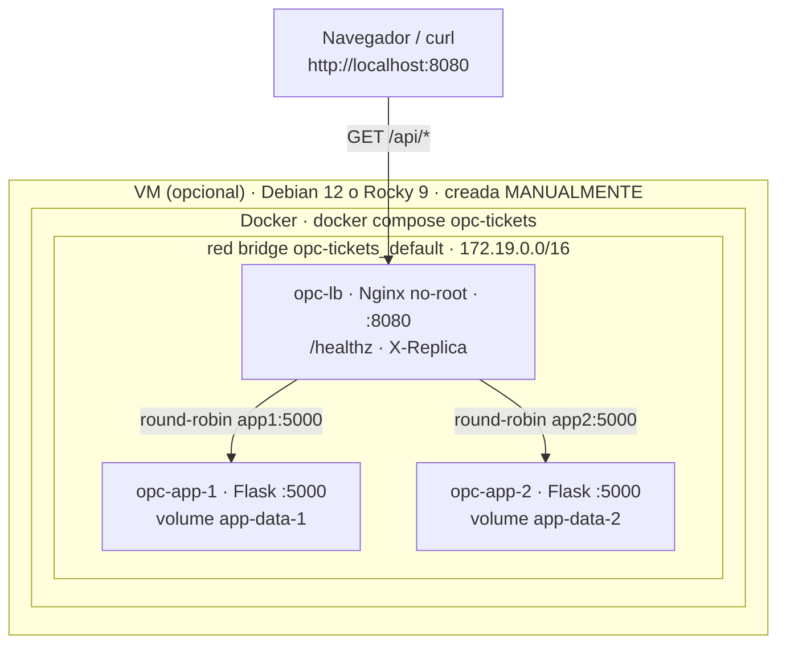
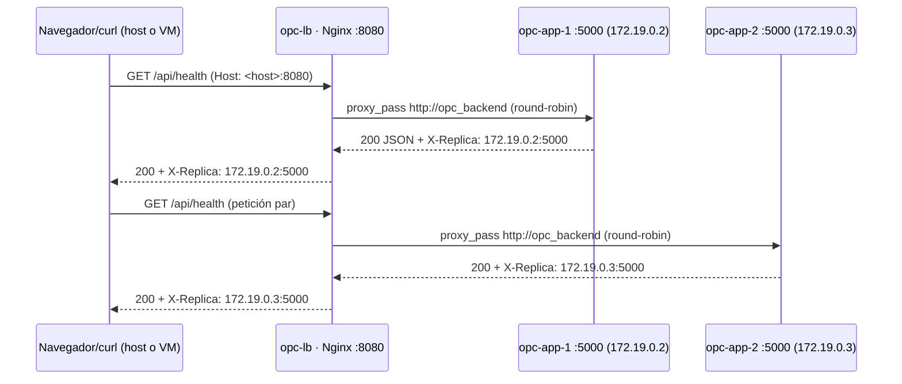

# Resumen de la infraestructura · OptiPlant (contexto autosuficiente para Claude)

> Documento de **referencia única** para que una herramienta IA (Claude) pueda
> validar diagramas de infraestructura y arquitectura del proyecto **sin leer
> toda la conversación ni recorrer los archivos**. Se describe únicamente lo
> que existe en el repositorio; nada de lo propuesto se presenta como
> implementado.
>
> **Etiquetas de estado usadas en todo el documento:**
> - **[C] Confirmado** → comprobado con pruebas ejecutadas (en el host de
>   desarrollo). Las **capturas/evidencias** las aporta el responsable del
>   informe (ver `infraestructura/README.md` §12.4 y `pruebas-estres.md`); este
>   repositorio no empaqueta archivos de evidencia.
> - **[I] Inferido** → conclusión razonable a partir del código/configuración,
>   aún **no** verificada en su entorno real.
> - **[P] Pendiente** → falta información o falta ejecutar la verificación.
> - **[R] Propuesto** → mejora futura que **no forma parte** de la
>   implementación actual.

---

## 1. Contexto y objetivo de la prueba técnica

Prueba técnica para **Ingeniero de Ciberseguridad y Soporte TI Interno** en
**OptiPlant Consultores**. Secciones cubiertas (mapeo según la guía de
evaluación proporcionada):

| Sección | Requisito | Estado |
|---|---|---|
| §3.1 | API Flask `opc-tickets` con alta disponibilidad: **2 réplicas** + **balanceador** Nginx, todo vía **Docker Compose** en un único host | **[C] implementado y evidenciado** |
| §3.2 | El mismo despliegue reproducible en **Debian 12** y **Rocky Linux 9**; VMs creadas a mano; automatización solo tras instalar el SO | **[C] preparación documentada** · **[P] evidencia en VMs pendiente** |
| §3.5 | Informe y evidencias de la prueba | **[C] verificaciones ejecutadas y comandos documentados** (capturas/umbrales a cargo del responsable) · **[P] despliegue en VMs** |

**Frontera explícita**: las VMs se crean **manualmente** en VirtualBox (ISO
propia). No se automatiza Vagrant/VBoxManage/preseed/kickstart/download de ISO.

---

## 2. Estado general del repositorio (git)

- Commits: `6fa8372` (inicial) → `d2e5afa` (app vulnerable) →
  `07fd2db` (importa infraestructura + `.dockerignore` + `config.py`).
- **[C]** Única modificación al código de la app: `app-vulnerable/backend/config.py`
  (variable opcional `APP_DATA_DIR`, usada por la persistencia). El resto de la
  app queda **intacto**.
- **[C]** Sin modificar durante esta auditoría final: `compose.yaml`,
  `nginx.conf`, `Dockerfile`, scripts, `.dockerignore`.

---

## 3. Arquitectura real implementada

- **[C]** Backend Flask servido por **2 contenedores** independientes de la
  misma imagen (`opc-backend:local`, construida por
  `infraestructura/docker/backend/Dockerfile`): `opc-app-1` y `opc-app-2`.
- **[C]** Balanceador Nginx `opc-lb` (`nginxinc/nginx-unprivileged:1.27-alpine`),
  con `upstream opc_backend { server app1:5000; server app2:5000; }`
  (**round-robin**, algoritmo por defecto).
- **[C]** Red compartida **bridge** `opc-tickets_default` (`172.19.0.0/16`),
  con **DNS interno de Docker** (`app1`→`172.19.0.2`, `app2`→`172.19.0.3`).
- **[C]** Solo `opc-lb` publica puerto: **`8080:8080`**. Las réplicas **no**
  publican puertos (solo `:5000` en la red interna).
- **[C]** Persistencia: named volumes `app-data-1` (→ `/app/data` de `app1`) y
  `app-data-2` (→ `/app/data` de `app2`), **no compartidos**.
- **[C]** Config del balanceador en bind mount `./deploy/nginx.conf` con `:ro,z`.
- **[C]** Frontend (SPA Angular 15) **NO desplegado**: `GET /` y `/index.html`
  en `:8080` devuelven **404** (medido).
- **[C]** No hay base de datos externa: **SQLite por réplica** dentro de `/app/data`.

### Diagrama de infraestructura (físico-lógico, ajustado a lo implementado)

> [C] En este equipo el stack corre actualmente en el **host** (Docker Engine),
> no dentro de una VM. En el despliegue objetivo corre dentro de la VM. El
> diagrama de la derecha muestra ambos planos porque los comparten.

---

## 4. Responsabilidad de cada componente

| Componente | Artefacto | Responsabilidad | Estado |
|---|---|---|---|
| `opc-lb` (Nginx) | `infraestructura/deploy/nginx.conf` | Puerta de entrada `:8080`; `proxy_pass` al upstream; round-robin; cabecera `X-Replica`; `/healthz` propio; logs a stdout | [C] |
| `opc-app-1`/`opc-app-2` | imagen `opc-backend:local` | Servir la API Flask `:5000`; cada una con su volumen | [C] |
| `app-data-1`/`app-data-2` | `compose.yaml` (`volumes:`, `name:`) | Persistir `/app/data` (SQLite, adjuntos, exportaciones, logs) por réplica | [C] |
| `setup_debian.sh` | `infraestructura/scripts/` | En VM Debian instalada: Docker CE + UFW (22/8080) + grupo docker | [C] código · [P] ejecución en VM |
| `setup_rocky.sh` | ídem | En VM Rocky instalada: Docker CE + firewalld (22/8080) + SELinux Enforcing + grupo docker | [C] código · [P] ejecución en VM |
| `Dockerfile` | `infraestructura/docker/backend/` | Imagen multi-stage no-root (usuario `opc`); crea `/app/data` | [C] |

---

## 5. Flujo de una petición

[C] Medido durante la ejecución en el host: **10 peticiones consecutivas** →
5/5 (o 10/10 alternadas) entre `.2` y `.3`. Comando de captura en
`infraestructura/README.md` §12.4.
[R] Nota: round-robin **no garantiza 50/50 exacto** en general; aquí
`worker_processes 1` hace la alternancia estricta a escala de laboratorio.

---

## 6. Redes, DNS, DHCP y puertos

> Detalle completo (planos de red, IPAM vs DHCP, DNS, flujo de paquetes) en
> `docs/infraestructura/redes.md`. Plan de pruebas de carga/estrés en
> `docs/infraestructura/pruebas-estres.md`.

### 6.1 Puertos y alcance [C]

| Componente | Nombre DNS / IP | Puerto | Alcance |
|---|---|---|---|
| `opc-lb` | `lb` (contenedor) | 8080 | publicado `8080:8080` en el host/VM |
| `opc-app-1` | `app1` → `172.19.0.2` | 5000 | solo red interna |
| `opc-app-2` | `app2` → `172.19.0.3` | 5000 | solo red interna |
| Red Compose | `opc-tickets_default` (bridge) | — | `172.19.0.0/16` |
| NAT VirtualBox (VM) | `enp0s3` → `10.0.2.15` (gw `10.0.2.2`) | 22 | VM↔Internet |
| Host-Only VirtualBox (VM) | `enp0s8` → `192.168.56.x` | 22 (SSH) | host↔VM |
| Healthcheck réplicas | `127.0.0.1:5000` (interno contenedor) | 5000 | healthcheck |
| Healthcheck lb | `127.0.0.1:8080` (interno `opc-lb`) | 8080 | healthcheck |

### 6.2 DNS [C]

- **DNS interno de Docker** (embebido `127.0.0.11`) resuelve `app1`/`app2`/`lb`
  dentro de la red del proyecto (comprobado con `getent hosts` en `opc-lb`). No
  hay ni hace falta servidor DNS propio.
- El DNS de la VM (`10.0.2.3`, VirtualBox NAT) resuelve Internet. **Son planos
  distintos**.
- Si una réplica se recrea y cambia de IP, el DNS de Compose la vuelve a
  resolver por nombre y Nginx no se toca; `X-Replica` muestra la IP nueva.

### 6.3 DHCP e interfaces [I/C]

- Quién asigna IPs: **VirtualBox** (DHCP del NAT con mapeo fijo `10.0.2.15` +
  DHCP del Host-Only `192.168.56.2–254`). No hace falta IP estática/reserva.
- `enp0s3` = 1.ª NIC (NAT); naming PCI predecible de systemd (Debian y Rocky
  con el mismo layout de VirtualBox). [I] El nombre exacto de NIC en cada VM
  nueva debe verificarse con `ip -4 addr`.
- El balanceador **no depende** de IPs de VM: usa DNS de Compose.

### 6.4 VirtualBox vs Docker [C]

- NAT/Host-Only/red interna de VirtualBox = infraestructura de VM.
- El bridge `opc-tickets_default` = red **interna de Docker** dentro de la VM.
- No se confunden ni se fusionan en diagramas.

---

## 7. Balanceo y comportamiento ante fallos

- **[C]** Config en `infraestructura/deploy/nginx.conf` (bloque `upstream`).
- **[C]** Resolución de réplicas: DNS interno de Compose (`app1`, `app2`).
- **[C]** Verificación por réplica: cabecera de respuesta `X-Replica: <ip:puerto>`
  (sin tocar la app).
- **[C]** Failover: con `docker compose stop app1`, 8/8 peticiones las responde
  `app2` (una mostró `172.19.0.2:5000, 172.19.0.3:5000` = reintento de Nginx).
  Tras `start app1`, la réplica vuelve a recibir tráfico (comando de captura en
  `infraestructura/README.md` §12.4).
- **[C] Limitación de Nginx**: la detección de fallo es **pasiva**
  (`max_fails=1`, `fail_timeout=10s` por defecto; reintento al primer
  `connect`/`read` fallido). No es un healthcheck activo (NGINX Plus); el
  healthcheck de Compose NO alimenta a Nginx, solo afecta al orquestado
  (`depends_on.condition: service_healthy`).
- **[C]** 2 réplicas en 1 host = **alta disponibilidad de servicio**, no
  redundancia física de máquinas.

---

## 8. Frontend, backend y base de datos

- **[C] Backend**: desplegado (2 réplicas).
- **[C] Frontend**: en el repo (`app-vulnerable/frontend`, Angular 15) pero
  **NO desplegado**: sin Dockerfile, sin servicio en Compose, sin `dist/`, 404 en `/`.
- **[C] El backend no sirve estáticos del frontend** (`app.py` solo tiene
  `/api/*` y `/adjuntos/*`).
- **[C] Base de datos**: SQLite local por réplica en `/app/data` (sin motor
  externo, sin red de BD compartida).
- **[I/R] Urls**: el frontend usa `apiBase='/api'` (relativo); en desarrollo
  `proxy.conf.json` reenvía `/api` a `localhost:5000`. Servirlo detrás del
  balanceador (mismo origen) sería compatible con `CORS_ORIGINS="*"`.
- **[P] Propuesta (no implementada)**: construir el SPA (`ng build`) y servirlo
  con un contenedor Nginx estático que proxifique `/api` al balanceador, o
  servir los estáticos desde el propio `opc-lb` (location para el SPA + proxy `/api`).

---

## 9. Persistencia y volúmenes

- **[C]** Named volumes `app-data-1` y `app-data-2`, montados en `/app/data`.
- **[C]** `docker compose down` **conserva** los volúmenes; `up -d` los
  reutiliza. Medido durante la ejecución: `app1=8` y `app2=7` tickets antes y
  después de `down`+`up` (procedimiento en `infraestructura/README.md` §13.6).
- **[C]** `docker compose down -v` **borra** los volúmenes (pérdida total; el
  siguiente `up` regenera la DB de demo).
- **[C]** SQLite no compartido entre réplicas (bloqueos/corrupción si se
  comparte). Consecuencia declarada: datos creados vía `app1` no se ven vía
  `app2`.
- **[R]** En producción: base de datos externa compartida (Postgres/MySQL)
  fuera de las réplicas. Fuera del alcance de la prueba.

---

## 10. Diferencias Debian 12 vs Rocky Linux 9

| Aspecto | Debian 12 | Rocky 9 | Estado |
|---|---|---|---|
| Gestor paquetes / formato | `apt` / `.deb` | `dnf` / `.rpm` | [C] |
| Firewall | UFW (`allow OpenSSH`, `allow 8080/tcp`, `--force enable`) | firewalld (`ssh`, `8080/tcp`, `--reload`) | [C] código · [P] ejecución |
| LSM | AppArmor (Docker gestiona perfiles) | SELinux **Enforcing** (bind nginx con `:z` → `container_file_t`) | [C] código |
| Repo Docker | `linux/debian` (por codename `bookworm`/`bullseye`) | `linux/centos` (canal RHEL; `docker-ce.repo`) | [C] |
| systemd | `systemctl enable --now docker` | ídem (+ `firewalld`) | [C] |
| Detección en scripts | `ID` + `VERSION_CODENAME` | `ID` (rocky/almalinux/rhel) | [C] |

**[C]** La capa de despliegue (`compose.yaml`, `nginx.conf`, `Dockerfile`) es
**idéntica** en ambas; solo cambia la preparación del SO. **[P]** Falta ejecutar
los `setup_*.sh` dentro de las VMs reales.

### 10.1 Firewall y Docker (documentado, no ejecutado en VM)

- Se abren solo `8080/tcp` (balanceador) y SSH en la interfaz de la VM.
- `5000` y las bases SQLite **nunca** se exponen a la red exterior.
- **[I]** Docker publica puertos con sus propias reglas de iptables, que se
  anteponen al filtro de la interfaz: la regla de UFW/firewalld **no** debe
  interpretarse como aislamiento absoluto del puerto publicado. En Rocky
  (firewalld/nftables) la interacción es la misma (iptables de Docker).
- **[P]** Comprobación en cada VM: `sudo ufw status verbose` (Debian) /
  `sudo firewall-cmd --list-all` (Rocky) y `iptables -L DOCKER -n`.

---

## 11. Seguridad del despliegue (hardening)

Implementado en el contenedor (`[C]`, visto en `docker inspect`):

- `USER opc` (backend) / uid `101` (nginx) → no root.
- `cap_drop: [ALL]` y `no-new-privileges:true` en los 3 servicios.
- Solo el `lb` publica puerto; réplicas internas.
- `restart: unless-stopped`; límites CPU/mem (réplicas 0.5/256M; lb 0.10/64M).
- Healthchecks de réplica y lb (estado `healthy` medido).
- `.env` con secretos gitignorado; `.dockerignore` excluye secretos/DB del build.
- Volúmenes de datos `named` (no bind mounts de host) salvo el bind `nginx.conf` (`:ro`).
- **[R]** mejoras opcionales (no aplicadas): `read_only` rootfs, healthcheck
  activo de Nginx, pin de imagen con digest.

---

## 12. Estado de pruebas y pendientes

**Verificaciones ejecutadas en el host de desarrollo** (sin archivos de
evidencia empaquetados; las **capturas las deja el responsable** por pantallazos
o informes con umbrales, ver `infraestructura/README.md` §12.4 y
`redes.md`/`pruebas-estres.md`):

- Estado del stack (3 servicios `healthy`), red/DNS/volúmenes, **10 peticiones
  balanceadas** (5/5), failover (stop/start + recuperación), persistencia
  (down/up conserva datos), hardening (no-root, `cap_drop`, límites).

**Pendientes**:
- Despliegue y pruebas **dentro** de VMs Debian 12 y Rocky 9 (creadas a mano).
- Verificación de `enp0s3`/`enp0s8` e IPs reales en cada VM nueva.
- Pruebas de carga/estrés y sus umbrales (a cargo del responsable).

---

## 13. Decisiones técnicas confirmadas y su justificación

1. **Compose en vez de Swarm/Kubernetes** — mismo resultado para 2 réplicas,
   sin orquestador extra ([C]).
2. **Nginx no-root** — sin privilegios; `8080:8080` (no 80) ([C]).
3. **2 servicios `app1`/`app2` con `container_name`** en vez de
   `deploy.replicas` — funciona en Compose standalone y da DNS estable
   (`app1`/`app2`) para el upstream ([C]).
4. **`worker_processes 1`** — round-robin estricto demostrable ([C]).
5. **No tocar la app** — balanceo demostrado con `X-Replica`; persistencia con
   una variable opt-in (`APP_DATA_DIR`) ([C]).
6. **Volumen por réplica (no compartido)** — SQLite no soporta escritura
   concurrente entre procesos ([C]).
7. **VMs manuales + setup_*.sh + compose** — frontera según requisitos: no se
   automatiza la creación de VMs ([C]).
8. **Named volumes sobre bind mounts** — portables entre Windows/Linux ([C]).
9. **Frontend fuera del despliegue** — evita tocar la app; la SPA se documenta
   como propuesta, no como desplegada ([C] estado / [R] mejora).

---

## 14. Limitaciones conocidas

- Round-robin es **por petición** (stateless); con sesiones/estado habría que
  usar `ip_hash`/sticky o almacenar estado fuera de las réplicas ([C]).
- 2 réplicas en un host = **HA de servicio**, no de máquina ([C]).
- Filtrar fallos de Nginx es **pasivo**; la ventana de `fail_timeout` existe ([C]).
- SQLite por réplica → **inconsistencia** entre réplicas ([C]); solución
  propuesta: BD externa ([R]).
- El frontend no está disponible [`404` medido] ([C]).

---

## 15. Criterios para validar diagramas (qué debe cumplir un diagrama correcto)

1. Un **balanceador Nginx** (`opc-lb`) + **dos réplicas Flask** (`opc-app-1`,
   `opc-app-2`) y ninguna otra unidad de servicio.
2. **Sin frontend desplegado** (si se dibuja, marcado como NO desplegado / propuesta).
3. **Sin base de datos externa** — SQLite **por réplica** en `/app/data`.
4. Tres planos de red diferenciados: Docker bridge (`opc-tickets_default`),
   VirtualBox NAT (VM→Internet), VirtualBox Host-Only (host↔VM).
5. Puertos exactos: `8080:8080` solo en `lb`; `5000` interno; SSH solo en VM.
6. Nombres exactos: `opc-lb`, `opc-app-1/2`, DNS `app1`/`app2`, volúmenes
   `app-data-1`/`app-data-2`.
7. Sin Swarm/Kubernetes/DNS propio/multi-host.
8. Flujo de petición termina en la réplica y vuelve con `X-Replica`.
9. Las VMs se dibujan como **creadas a mano** (VirtualBox), no automatizadas.
10. Diferencias Debian/Rocky solo en la capa de preparación del SO, no en el
    diagrama de contenedores.